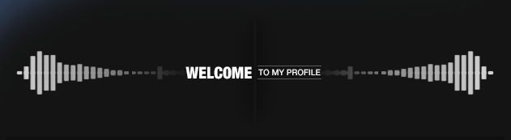

<!-- banner image starts here  -->
<!--  -->
<!--  -->
<!-- banner image ends here  -->

<!-- <h1> 👋 Hello, I'm MD. Shahadot Hossain </h1> -->

  

<!-- History Snake -->

<!-- A full time Full Stack Developer
 
🏠 &nbsp; Living: Dhaka, Bangladesh -->

<!-- Contact me section starts here  -->

[][website]
[][youtube]
[][facebook]
[][linkedin]
 
 

<!-- Contact me section ends here  -->

<!-- about-me section starts here  -->

### 👨‍🏫 &nbsp; About Me

I'm Md. shahadot hossain, a senior full-stack engineer, creative coder and self-proclaimed designer who specializes in front-end development. I make it my mission to translate user-focused designs into pixel-perfect websites or applications that run blazing fast. Also I work with backend.

Want to know more about me? [Check out my portfolio.](https://shrcreation.com/)
 
<!-- about-me section ends here  -->

## 📌 Pinned Repositories

 

 
 

 

## &#x1f4c8; GitHub Stats

 

 
 

<!-- web related skills section starts here  -->
## 👨🏽‍💻 Skills

More Skills

 

<!--

 -->

<!-- work experience section starts here  -->

### 💼 &nbsp; Employment History

| Position            | Institute                                   | Duration            | Location           |
| ------------------- | ------------------------------------------- | ------------------- | ------------------ |
| Full-Stack Developer| TFP Solutions Bangladesh Ltd                | Mar 2023 - Continue | Dhaka, Bangladesh  |
| Web Developer       | Abeer Food Ltd                              | Oct 2022 - Jan 2023 | Dhaka, Bangladesh  |
| Full-Stack developer| Global Skills Development Agency            | Feb 2022 - Sep 2022 | Dhaka, Bangladesh  |

<!-- work experience section ends here  -->
<!-- education section starts here  -->

<!-- ### 👨🏻‍🎓 &nbsp; Education

1. B.Sc. in Computer Science & Engineering  
   Green University  
   Dhaka, Bangladesh.
   
2. Higher Secondary School Certificate
    
   Govt. Shah Sultan College 
    
   Bogra, Bangladesh.
   
3. Secondary School Certificate
    R.B Govt. High School 
    Joypurhat, Bangladesh

 

<!-- education section ends here  -->

<!-- training section starts here  -->

<!-- ### 👨🏻‍🎓 &nbsp; Training

1. Laravel & React Specialist 
    Started Laravel & React at Global Skills Development Agency 
    Dhaka, Bangladesh.
    Period: 11/22-present
   
2. Advance Mobile App Marketing
    Complete Advance Mobile App Marketing at MSB Academy
    Dhaka, Bangladesh.
    Period: 02/20 to 07/20
   
3. Android App Development
    Complete Android App Development at MSB Academy 
    Dhaka, Bangladesh
    Period: 07/19 to 01/20
   
4. Web Development
    Complete Web Development at New Horizon
    Dhaka, Bangladesh
    Period: 09/17 to 02/18

5. Web Designer
    Complete Web Designer at Creative It Institute
    Dhaka, Bangladesh
    Period: 02/17 to 07/17

6. Basic Photography
    Pathshala Institute
    Dhaka, Bangladesh
    Period: 02/18 to 05/18   

<!-- training section ends here  -->

<!-- my languages section starts here  -->

<!-- ### Languages:

- 🇧🇩 Bangla : Native
- 🏴󠁧󠁢󠁥󠁮󠁧󠁿 English : Communication
- 🇮🇳 Hindi : Intermediate
    -->

<!-- my sports and game section starts here  -->

### Sports / Game / Activities / Hobby:

- 🏏 Cricket, ⚽ Football, 🏸 Badminton,
- 🏊‍♂️ Swimming, 🏃‍♂️ Running, 🚶‍♂️ Walking
- ✈️ Travelling

 
<!-- my sports and games section ends here  -->

<!-- Honors & awards section starts here  -->

<!--
### 🏅 Honors & Awards :
-->

Thanks for going through my Portfolio.
All rights reserved by MD. Shahadot Hossain @2023

--

<!-- Links section starts here -->

[website]: http://www.shrcreation.com/
[youtube]: https://www.youtube.com/channel/UC6ilHykZxnKn0PNxZgsx1Dw
[facebook]: https://web.facebook.com/shahadot.shr.rahat/
[linkedin]: https://www.linkedin.com/in/shahadot786
[github]: https://github.com/shrcreation

<!-- Links section ends here -->
<!-- Snake Animation -->
<!-- ## 📈 My GitHub History! -->
<!--  -->

